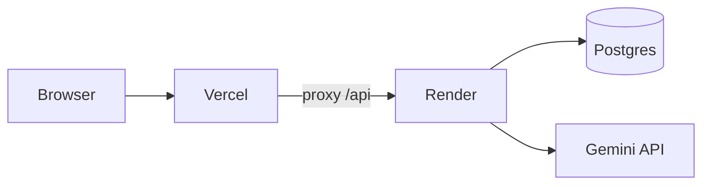

# LLM Eval Pipeline

[](https://github.com/Srikanthkn0/llm-eval-pipeline/actions/workflows/ci.yml)
[](LICENSE)

CSV-based evaluation platform for prompt and model quality checks. Upload test cases, run async eval jobs against live LLMs, review per-case scores, and block regressions in CI.

| | Link |
|---|------|
| **Live app** | https://llm-eval-pipeline.vercel.app |
| **API** | https://llm-eval-pipeline-api.onrender.com |
| **API docs** | https://llm-eval-pipeline-api.onrender.com/docs |

## Features

- Upload and validate CSV datasets (`input`, `expected_output`, optional `category`)
- Async eval jobs with progress polling (suited for slow LLM APIs)
- Multi-provider routing: Gemini (prod), Groq/OpenAI optional, mock model for CI
- Scoring via exact match, normalized match, and keyword overlap
- Persistent storage: SQLite locally, PostgreSQL (Neon) in production
- GitHub Actions CI with an 80% pass-rate gate on the sample suite

## How it works



1. Upload a CSV or use the seeded `sample` dataset (5 rows).
2. Pick a model and prompt template with an `{input}` placeholder.
3. The backend queues a job, calls the LLM per row, scores each response, and saves the run.
4. Review pass rate and per-case results in the dashboard.

## Stack

| Layer | Technology |
|-------|------------|
| Backend | FastAPI, gunicorn, SQLite / PostgreSQL |
| Frontend | React, Vite |
| LLM | Gemini 2.5 Flash (Render), mock model in CI |
| CI/CD | GitHub Actions |
| Deploy | Vercel + Render + Neon (free tier) |

## Repository layout

```
llm-eval-pipeline/
  backend/           FastAPI API, eval engine, pytest suite
  frontend/          React dashboard
  render.yaml        Render blueprint (backend)
  .github/workflows/ CI pipeline
  DEPLOYMENT.md      Production setup guide
```

## Local development

**Backend**

```bash
cd backend
python3 -m venv venv && source venv/bin/activate
pip install -r requirements-dev.txt
cp .env.example .env
uvicorn app.main:app --reload --port 8000
```

**Frontend** (separate terminal)

```bash
cd frontend
npm install && cp .env.example .env
npm run dev
```

Open http://localhost:5173. No API keys required: `mock-model-v1` handles local runs and CI.

**Tests**

```bash
cd backend
pytest tests/ -v
python scripts/run_ci_eval.py --min-pass-rate 0.8
```

## API

| Method | Path | Description |
|--------|------|-------------|
| `GET` | `/health` | Status, database, LLM provider config |
| `GET` | `/api/models` | Available models |
| `GET` | `/api/stats` | Dataset and run aggregates |
| `POST` | `/api/datasets/upload` | Upload CSV (`replace=true` to overwrite) |
| `DELETE` | `/api/datasets/{name}` | Delete a dataset |
| `POST` | `/api/evals/run` | Start eval job (returns `job_id`) |
| `GET` | `/api/evals/jobs/{id}` | Poll job status and progress |
| `GET` | `/api/evals/runs` | List past runs |
| `GET` | `/api/evals/runs/{id}` | Full run with per-case results |

## CI

Every push to `main` runs:

1. Backend unit and API tests (`pytest`)
2. Sample eval against `backend/sample_data/sample_eval.csv` using the mock model
3. Build failure if pass rate falls below 80%

## Production deployment

See [DEPLOYMENT.md](DEPLOYMENT.md) for Neon Postgres, Render, Vercel, and Gemini API setup.

Notes for the live deployment:

- Vercel proxies `/api` and `/health` to Render (no `VITE_API_BASE_URL` needed).
- Render free tier sleeps after idle; the first request after sleep can take 30-60 seconds.

## Scoring

Each test case is scored 0.0-1.0. A case passes at >= 0.8:

- **1.0** - exact string match
- **0.9** - normalized match (lowercase, trimmed, collapsed whitespace)
- **0.0-0.8** - keyword overlap between expected and actual output

## License

MIT. See [LICENSE](LICENSE).