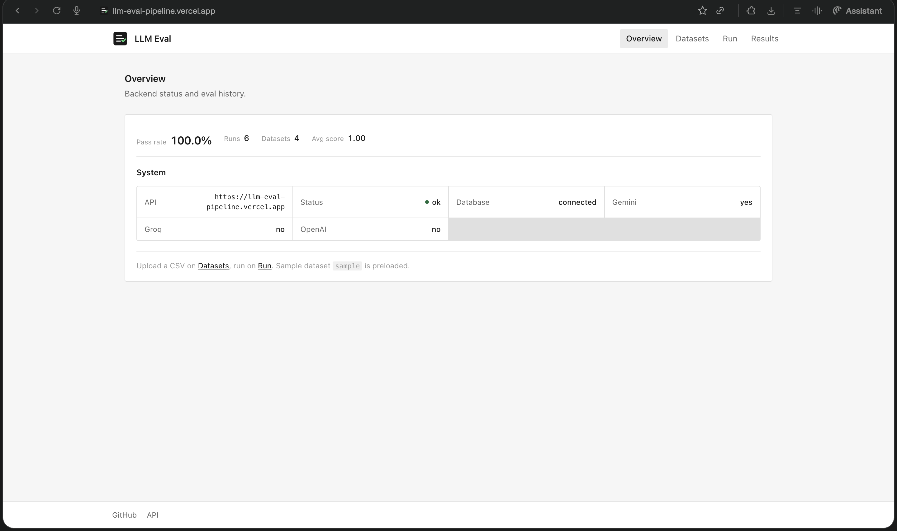
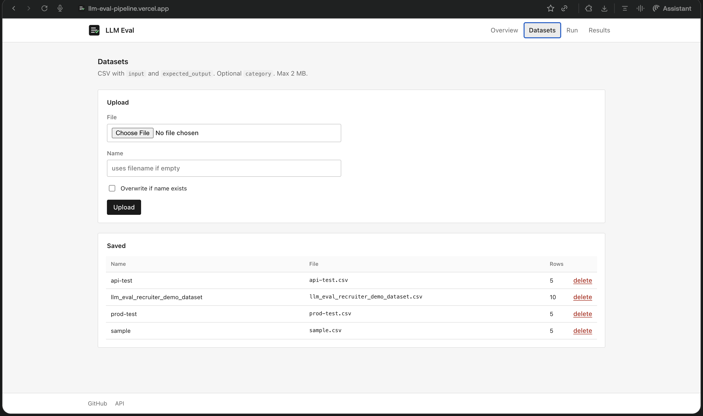
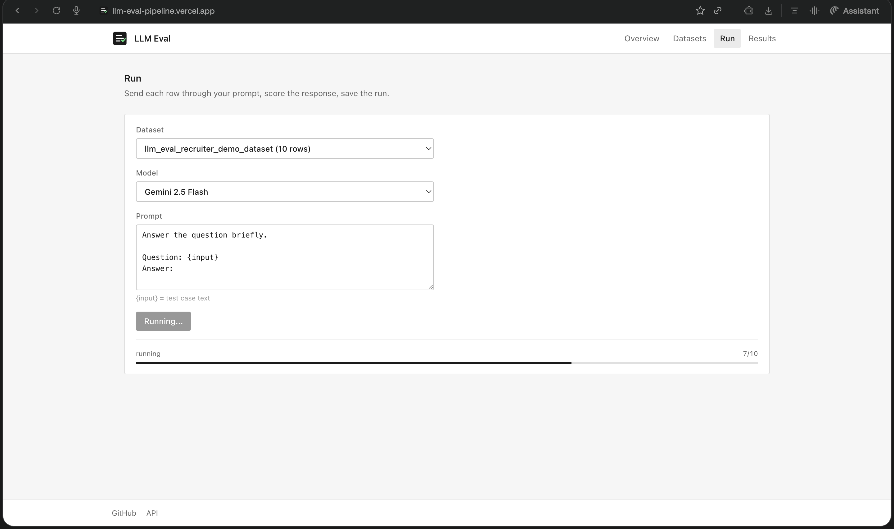
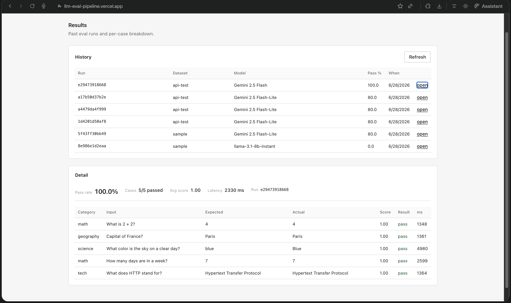

# LLM Eval Pipeline

[](https://github.com/Srikanthkn0/llm-eval-pipeline/actions/workflows/ci.yml)
[](LICENSE)

Upload a CSV of test cases, run them against an LLM, score the outputs, and store the results. Built for quick prompt/model checks and a simple CI gate.

- App: https://llm-eval-pipeline.vercel.app
- API: https://llm-eval-pipeline-api.onrender.com
- Docs: https://llm-eval-pipeline-api.onrender.com/docs

## Screenshots

| Overview | Datasets |
|:---:|:---:|
|  |  |

| Run | Results |
|:---:|:---:|
|  |  |

## What it does

1. You upload a CSV (`input`, `expected_output`, optional `category`) or use the bundled `sample` set.
2. You pick a model and a prompt template with `{input}`.
3. The backend runs one LLM call per row, scores each answer, and saves the run.
4. You read pass rate and per-case results in the UI.

Async jobs matter here — LLM calls are slow, so evals run in the background with progress polling.

## Stack

FastAPI + gunicorn on Render, React/Vite on Vercel, Neon Postgres in prod, SQLite locally. Gemini for live inference on Render; `mock-model-v1` for local dev and CI.

```
Browser → Vercel → (proxy /api) → Render → Neon
                              └→ Gemini or mock
```

## Repo layout

```
backend/     API, eval engine, tests
frontend/    React UI
render.yaml  Render service config
DEPLOYMENT.md
```

## Local setup

Backend:

```bash
cd backend
python3 -m venv venv && source venv/bin/activate
pip install -r requirements-dev.txt
cp .env.example .env
./run.sh
```

Frontend (other terminal):

```bash
cd frontend
npm install && cp .env.example .env
npm run dev
```

Open http://localhost:5173. No API keys needed locally — but `mock-model-v1` does **not** call an LLM (see below).

## Mock vs real models

| Model | What actually happens |
|-------|----------------------|
| `mock-model-v1` | Substring match on the prompt → hardcoded answer. No API call. |
| `gemini-*`, `gpt-4o-mini`, Groq | HTTP request to the provider with your prompt. |

The `sample` dataset (5 rows) was written to match the mock's hardcoded phrases, so mock always scores 100% on it. That is useful for CI, not proof of LLM quality.

To verify a real model: set `GEMINI_API_KEY`, pick **Gemini 2.5 Flash-Lite**, run the `general` dataset. Mock fails every row; Gemini should pass most.

## Guardrails (input + output)

| Phase | When | What |
|-------|------|------|
| Input | Before LLM | 40+ injection/jailbreak/credential rules |
| Output | After LLM | Leak detection (system prompt, API keys, unsafe commands) |
| Normalize | Before match | NFKC + zero-width character strip |

Rules are public (`GET /api/guard/rules?scope=input|output`, **Rules** tab).

Eval flow: `input scan → LLM → output scan → score`. Blocked rows never store raw unsafe output.

## Production hardening

| Feature | Config |
|---------|--------|
| API key auth | `API_KEY` + `REQUIRE_API_KEY=true` (header: `X-API-Key`) |
| Rate limits | `RATE_LIMIT_*` env vars |
| Eval bounds | `MAX_EVAL_ROWS`, `MAX_PROMPT_CHARS`, `MAX_CONCURRENT_JOBS` |
| Request tracing | `X-Request-ID` on every response |
| Health probes | `/health/live`, `/health/ready`, `/health/guard` |
| Security headers | `X-Content-Type-Options`, `X-Frame-Options`, etc. |

**52 tests** including guard, output scan, CORS, and middleware checks.

Tests:

```bash
cd backend
pytest tests/ -v
python scripts/run_ci_eval.py --min-pass-rate 0.8
```

## API

| Method | Path | Notes |
|--------|------|-------|
| GET | `/health` | DB + provider config |
| GET | `/api/models` | Models you can run |
| GET | `/api/stats` | Run and request aggregates |
| GET | `/api/logs` | Request log (`?decision=pass&provider=mock`) |
| POST | `/api/datasets/upload` | CSV upload; `replace=true` overwrites |
| DELETE | `/api/datasets/{name}` | Delete dataset |
| POST | `/api/evals/run` | Queue job; returns `job_id` |
| GET | `/api/evals/jobs/{id}` | Job status + progress |
| GET | `/api/evals/runs` | Past runs |
| GET | `/api/evals/runs/{id}` | Run detail with per-case rows |

## CI

On push to `main`: `pytest`, then a sample eval with the mock model. Fails if pass rate drops below 80%.

## Production

See [DEPLOYMENT.md](DEPLOYMENT.md).

Render build: `pip install -r requirements.txt`  
Render start: `gunicorn app.main:app -k uvicorn.workers.UvicornWorker --bind 0.0.0.0:$PORT --workers 1 --timeout 120`

Vercel build: `npm run build` (static `dist/`)

Vercel proxies `/api` and `/health` to Render, so you don't need `VITE_API_BASE_URL` in prod. Render free tier sleeps — first request after idle can take 30–60s.

## Scoring

Score is 0.0–1.0. Case passes at ≥ 0.8.

- 1.0 — exact match, or match after lowercasing/trimming/collapsing whitespace
- below 0.8 — keyword overlap between expected and actual tokens

## License

MIT — see [LICENSE](LICENSE).